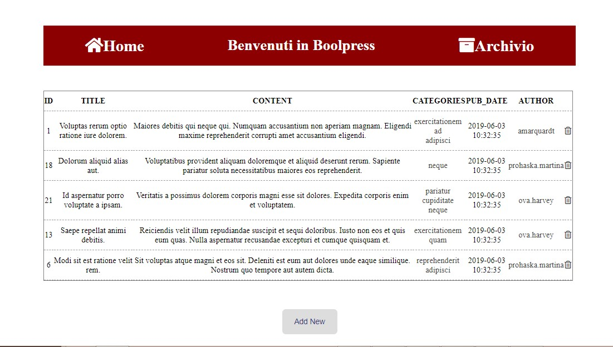
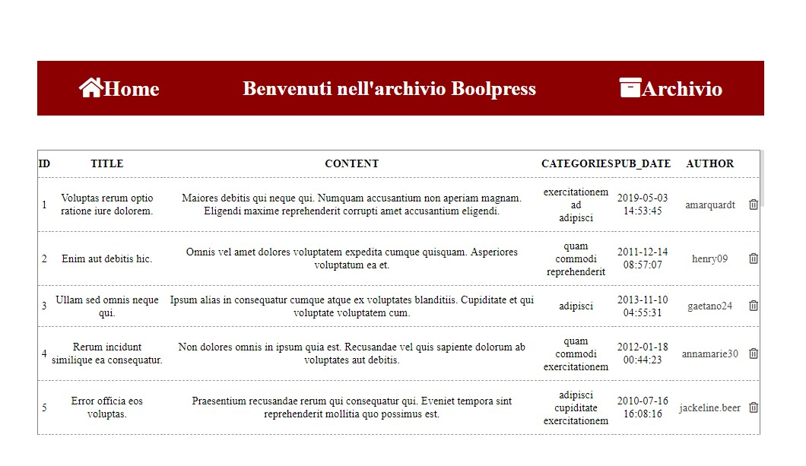
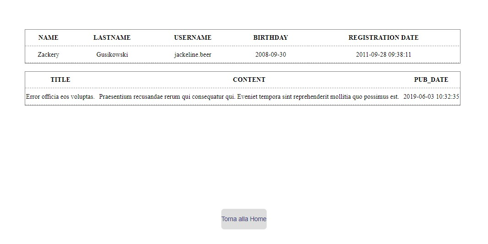
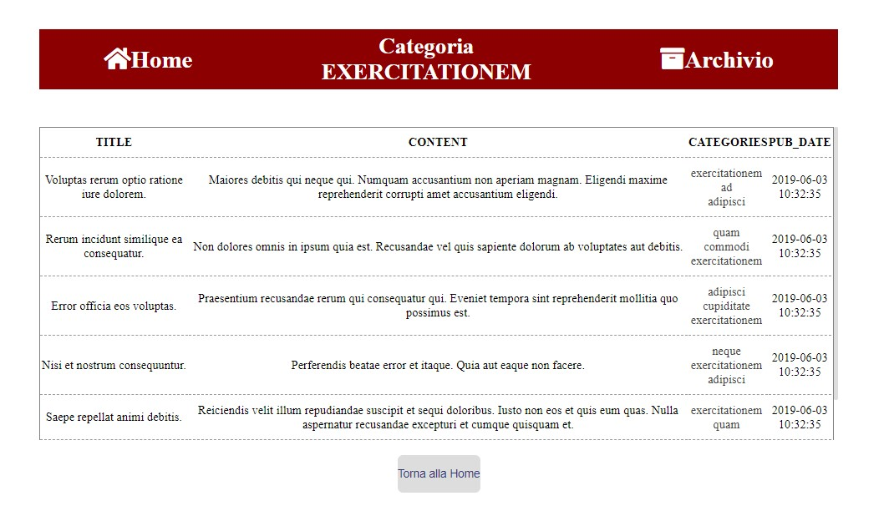

# Boolpress

# Obiettivo:
Creare una web application con Laravel ipotizzando di creare un forum o un blog. Non ho voluto dare troppa importanza alla grafica, ma focalizzzarmi sulla costruzione del database e sulla logica del sito.

# Utilizzo:
Nella homepage vengono mostrati in ordine cronologico gli ultimi 5 post del blog. Ogni riga contiene il titolo del post, il contenuto, le categorie di appartenenza, la data di pubblicazione e lo username dell'autore. 
Si può accedere allo storico dei post, cliccando la voce "archivio" presente nel header del sito. 
Allo stesso modo si può visualizzare lo storico dei post di ogni autore e i dettagli relativi allo stesso, semplicemente cliccando sul nome nella colonna "author".
Cliccando su una delle categorie potremo accedere a tutti i post che contengono quella specifica categoria.

# Tecnologie usate
Laravel, PHP, PhpMyAdmin, MySQL, SASS

# Screenshot

